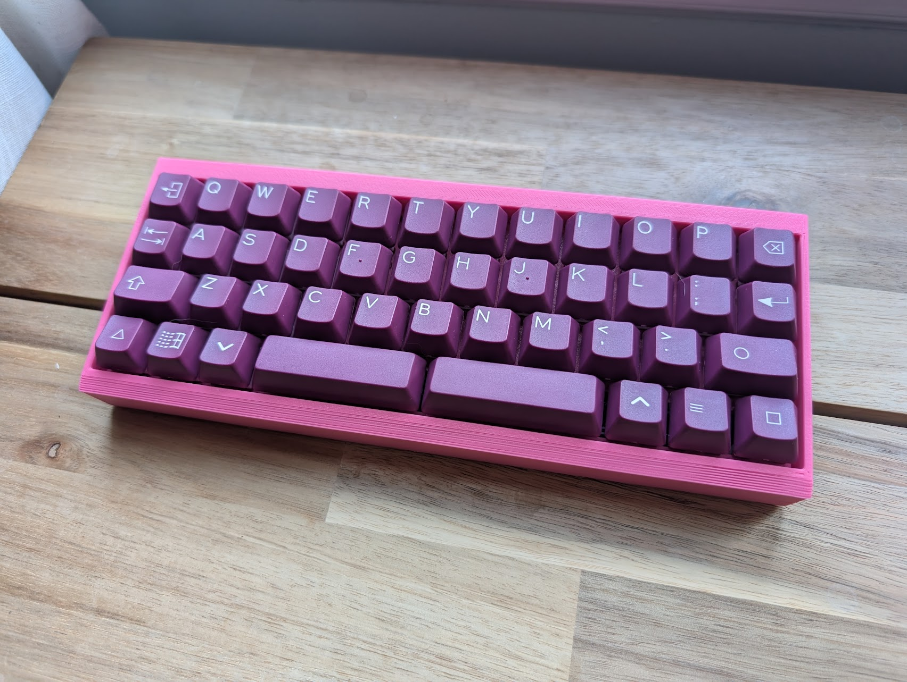
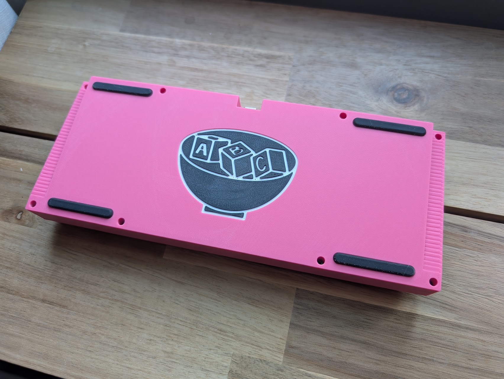
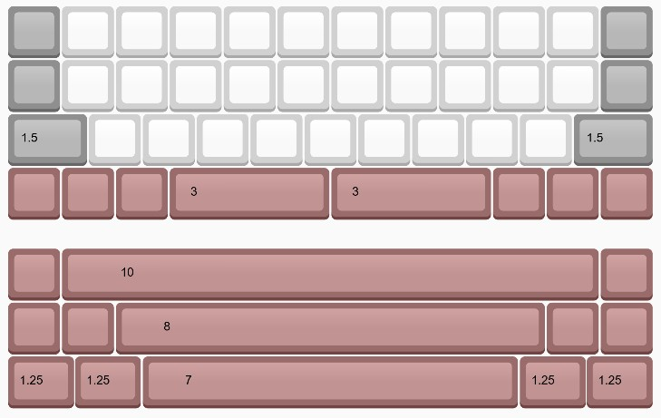

# Boyardee
Case for the [Alphable PCB](https://github.com/DashDashUnderscoreDash/Alphable-PCB) by DashKeebs 
(Also see his [github](https://github.com/DashDashUnderscoreDash/) or [store](https://www.dashkeebs.com/)))

  
  

  <i>Case printed in pink by Dash (thanks!) with DCS Sommelier</i>

Case design heavily inspired by the [bully](https://github.com/zhol0777/bully-files) by Zhol, one of my favorite cases

* 5° typing angle
* 8 mm top/bottom bezel
* 2.5 mm side bezels
* Supports 8 wheel weights for **heft**

## KLC
PCB is a simple 12u alpha stagger board. See layout options below:

## Build notes
This case has been tested and seems to work a-okay, but proceed at your own risk!

## Required hardware
* M2×4mm (or 5mm) screws *(12×)*
* M2×3mm heatset inserts *(12×)*
* SKUF Feet *(4×)*
* Geon tadpoles *(8×)*
  * US vendor: [Saberkeebs](https://saberkeebs.com/products/geon-tadpoles)
  * Worldwide vendor: [Geon](https://geon.works/products/tadpole)
* JST Unified Daughterboard (C3)
* Alphable PCB: see [DashKeebs](https://www.dashkeebs.com/)
* *Optional: 8× wheel weights*

## Acknowledgements
* Much appreciation to Dash (DashDashUnderscoreDash (--_-)) for designing the PCB and helping with testing! Again, go check him out and support him: [github](https://github.com/DashDashUnderscoreDash/) or [store](https://www.dashkeebs.com/)
* As mentioned, the case design is heavily inspired by the [bully](https://github.com/zhol0777/bully-files) by Zhol
* Many thanks to Calumwri and Swear_wolf for suggestions on the engraving design!
